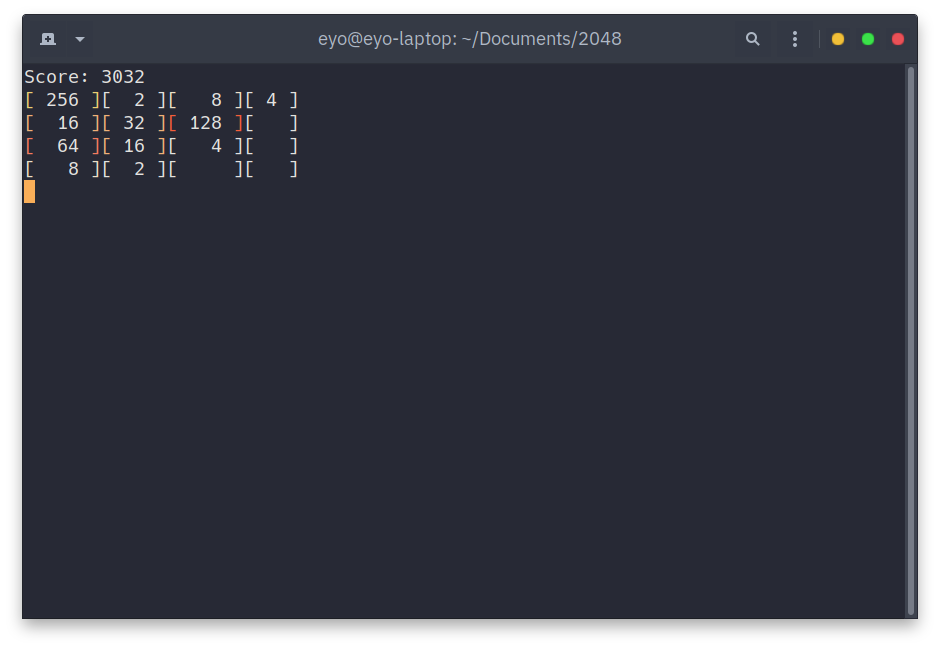

# Terminal 2048
A C implementation of the game 2048 that runs in the terminal.

    

Features proper non-greedy movement, directional merging priority, bracket spacing, 10% chance of a new block being 4 instead of 2, etc.

The core loop is fully functional, but certain quality of life features may be added later.

### To do
- Add a notification for winning the game.
- Add a `--help` argument
- Maybe add arguments to use alternate grid sizes or other kinds of experimental faetures
- Maybe add "animations" and color

### Installation
To compile, install `ncurses` and use the included Makefile *or* run `gcc -o 2048 2048.c -lncurses` in the folder you want to contain the program.

### Running
Use `~/path/to/executable/2048` to run the game.
Use WASD to shift blocks, Q to quit.

Tested on Ubuntu.